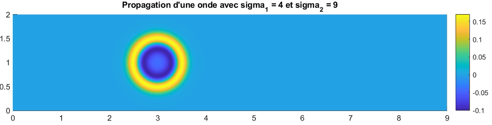

## Numerical resolution of wave equation in the temporal regime

This mini-project is a standard application of Finite Element Method for elliptic and hyperbolic PDEs with Dirichlet boundary condition. The first part concerns the resolution of Laplace equation with a non-homogeneous elasticity in 
a rectangular domain while in a second time, one deals with the propagation of a wave in this same inhomogeneous medium.

### Stationary resolution
The resolution of the Laplace equation via the Finite Element Method is standard here. After an adequate discretization of the Sobolev space, it amounts to solving a linear equation. The associated matrix is known to be sparse; MATLAB takes advantage of such a structure to accelerate the resolution of the linear equation. 

In a homogeneous medium:

In a nonhomogeneous medium:
 
On the left is the elasticity coefficient while on the right, is the numerical solution.

### Temporal resolution
When dealing with hyperbolic PDEs, it is common to treat the space and time variable differently. The temporal derivative is discretized via a finite-difference scheme, while the spatial part is discretized thanks to the finite element method. More specifically, the temporal discretization is done with the classical leap-frog scheme for two times derivatives. Concerning the computation of the mass matrix, three different techniques are employed: 
- Standard Quadrature,
- Mass condensation,
- and Cholesky decomposition.
In the illustrations below, we have the case of a domain separated into two homogeneous part; the left-half and right-half of the rectangular domain.

  
  
